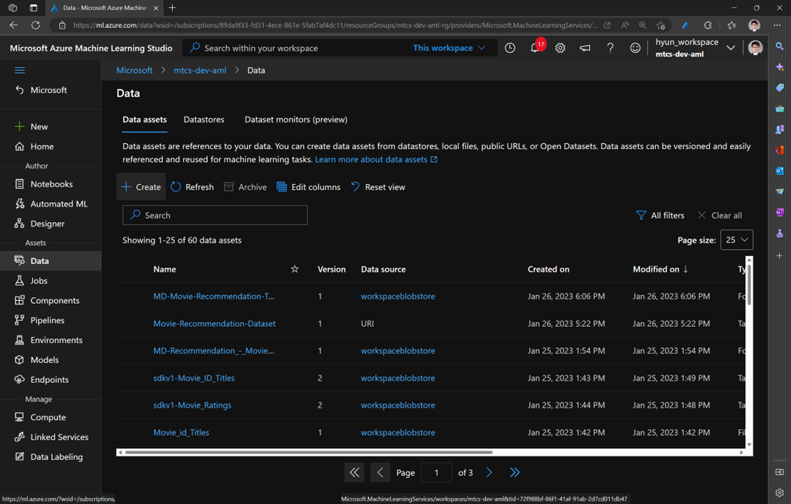
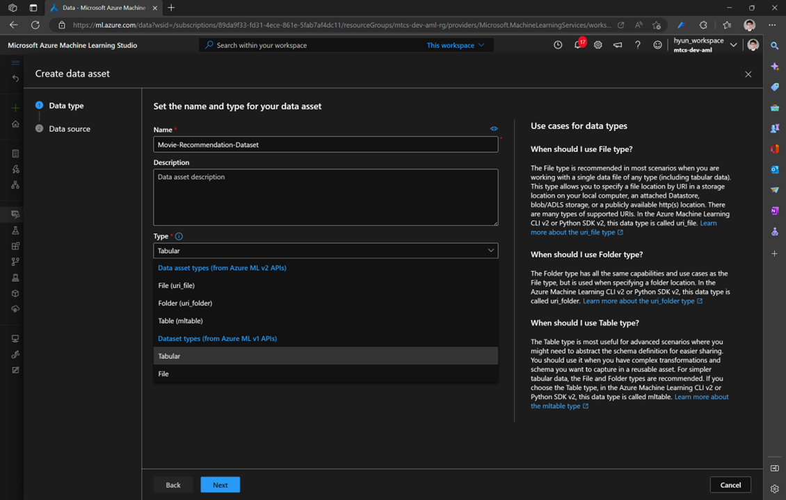

# Movie Recommender

## 1. Add Data

In this step, you're going to create Data Asset to use for this lab

### 1.1. Open AML Studio

Go to [AML Studio](https://ml.azure.com)

### 1.2. Create Data

Click `Data` and click `create` in the 'Data assets'



### 1.3 Data type

Fill out the data asset name

Must select `type` as `Tabular` Dataset types (from Azure ML v1 APIs)



Click `Next`

### 1.4. Data Source

Select `From web files` and click `Next`

### 1.5. Web URL

Copy and paste following url, and leave `Skip data validation` unckeck

```text
https://github.com/hyssh/movie-recommender/raw/main/data/recommender-Movie-Dataset.csv
```

### 1.6. Settings

There are nothings to change, but just check data is being loaded in 'Data preview'

Click `Next`

### 1.7. Schema

There are nothings to change, click `Next`

### 1.8 Review

There are nothings to change, click `Create`

## Next

[2. Train SVD Recommender](./2.TrainModel.md)