# Movie Recommender

## 2. Train SVD Recommender

[Train SVD Recommender](https://learn.microsoft.com/en-us/azure/machine-learning/component-reference/train-svd-recommender)


### 2.1. Create new pipeline

Make sure `Classic prebuilt` is selected and then click `'Create a new pipeline...'` in the AML Studio

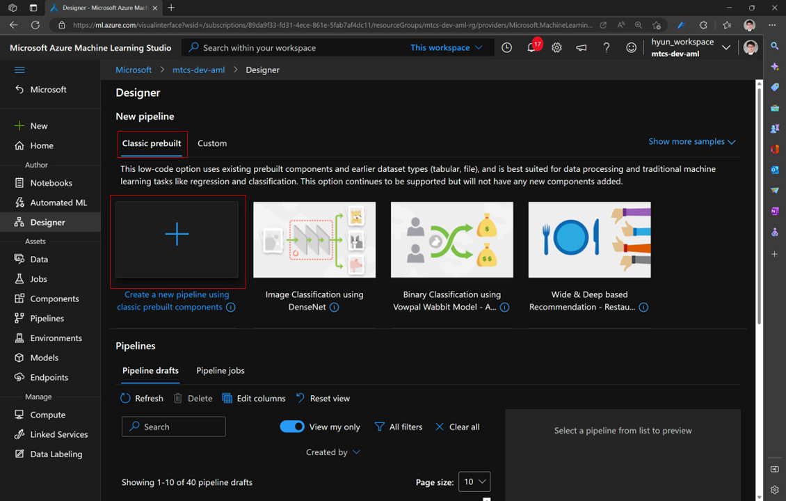


### 2.2. Edit pipeline name

Click the pencil icon to edit pipeline name

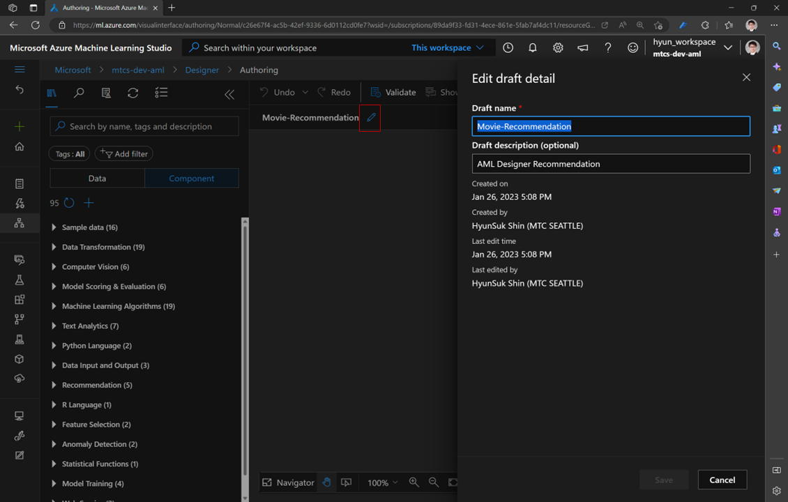


### 2.3. Load data

Make sure `Data` is selected in the left panel

You can search your data asset in the seach text bar

`Drag and drop` the data asset to canvas

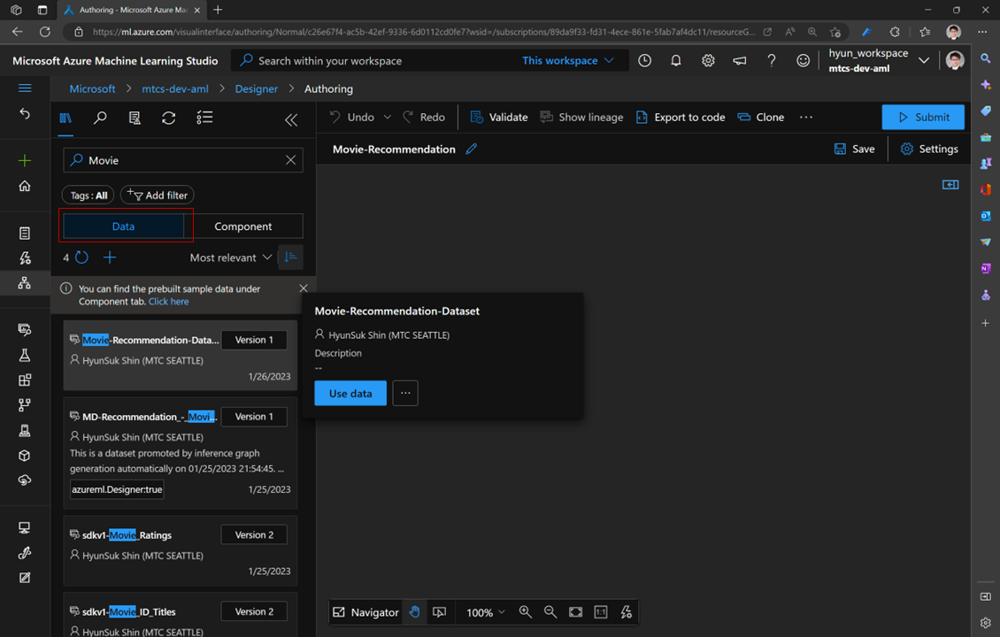

### 2.4. Split 

`Drag and drop` `'Split Data'` component in the cavas, and then connect dots between the data asset and Split data component

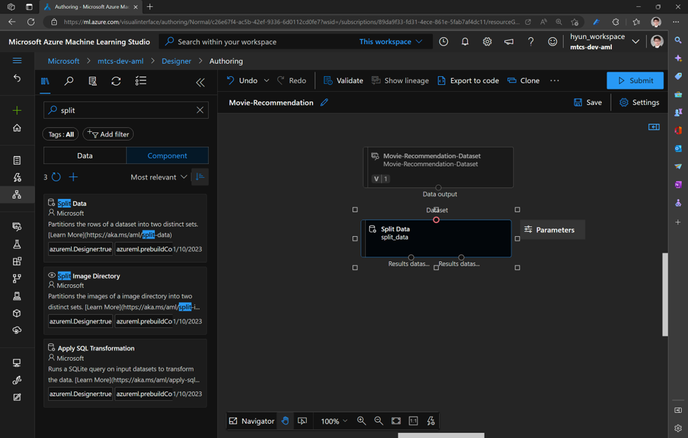


### 2.5. Update parameter of 'Split Data'

Modify `'Fraction of rows in the first output dataset'` to `0.75`

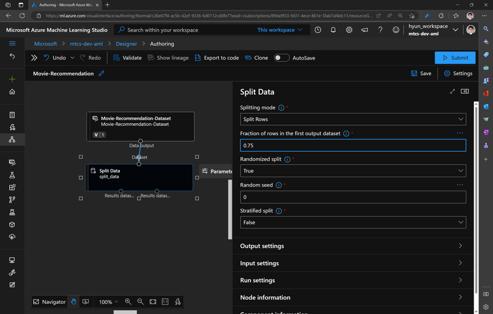

### 2.6. Layout components on the canvas

`Drag and drop` following components on the canvas

- Train SVD Recommender
- Score SVD Recommender
- Evaluate Recommender
- Select Columns in Dataset

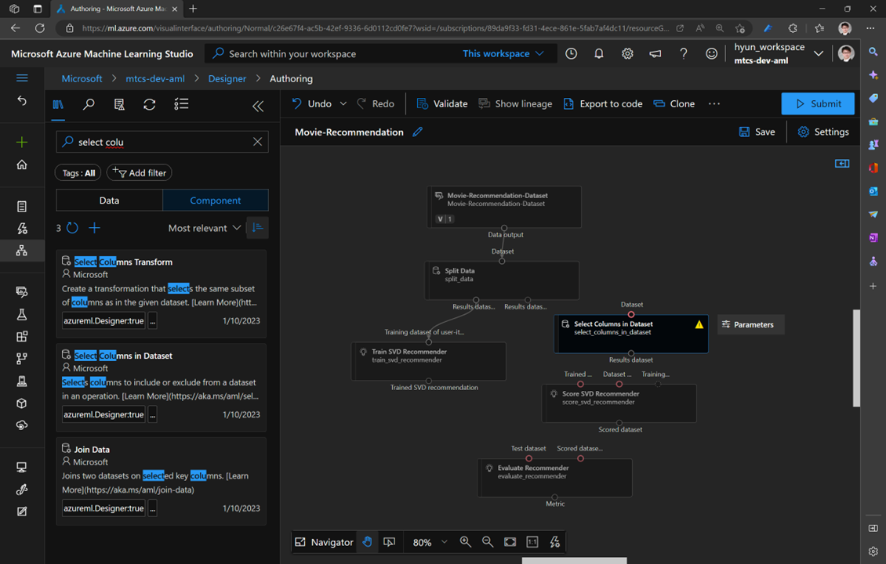

### 2.7. Connect the dots 

Connect the `left` of output port of the `'Split Data'` component with `'Train SVD Recommender'`

Connect the `right` of output port of the `'Split Data'` component with `'Select Columns in Dataset'`

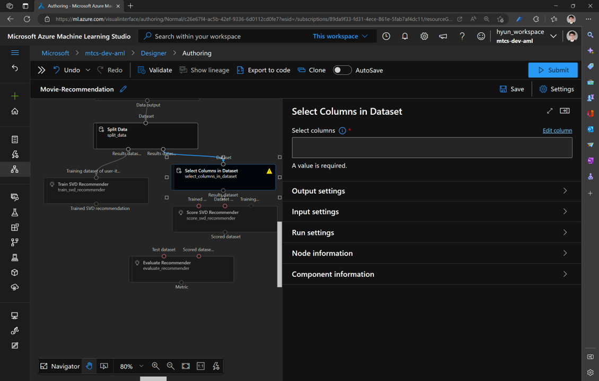

### 2.8. Select columns in Dataset

Double click `'Select Columns in Dataset'`

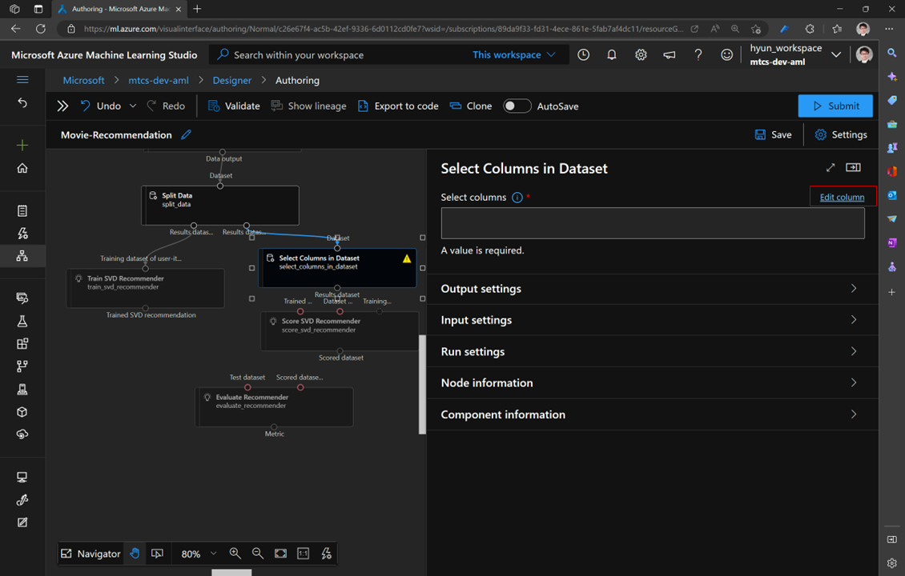


Copy and paste following text in the text box, and `click 'Save'`

```text
UserId, Movie Name
```

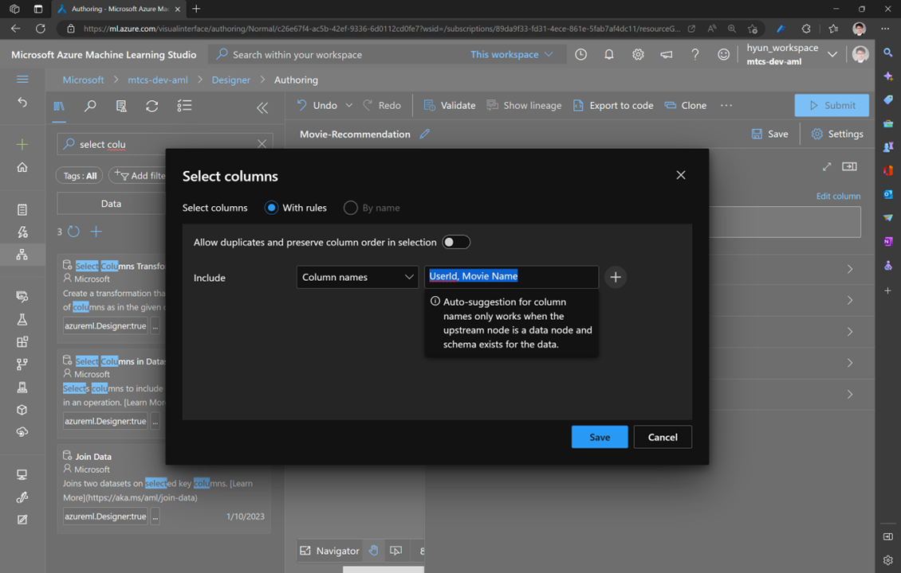

### 2.9. Connect dots

- Connect output port of `'Train SVD Recommender'` with `left input` port of `'Score SVD Recommender'`
- Connect output port of `'Select Columns in Dataset'` with `middle input` port of `'Score SVD Recommender'`
- Connect `right output` port of `'Split Data'` with `left input` port of `'Evaluate Recommender'`
- Connect `output port` of `'Score SVD Recommender'` with right input port of `'Evaluate Recommender'`

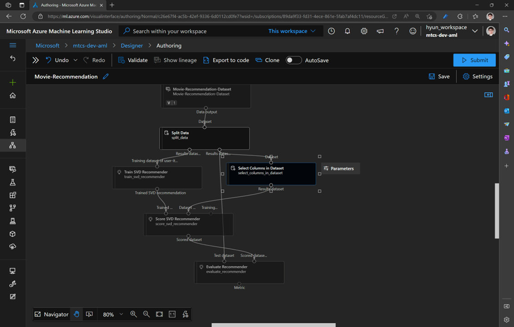


### 2.10. Select Compute 

Click `Settings`, select 'Azure ML compute cluster', and then `Submit` job

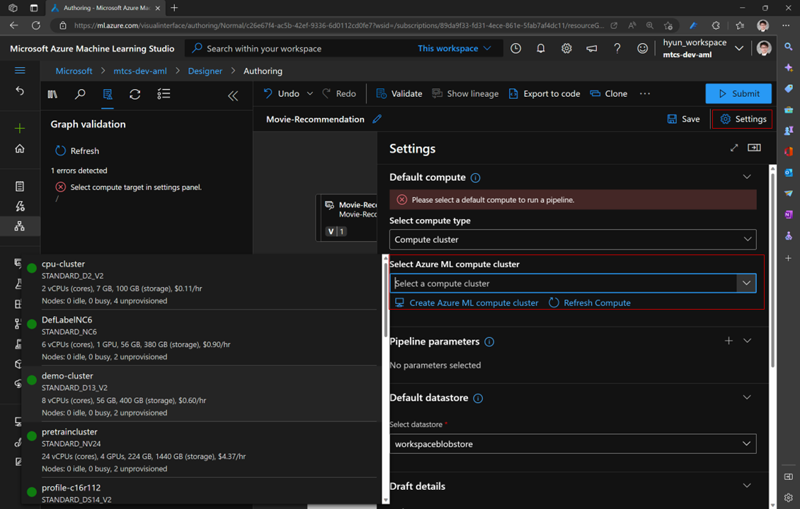


### 2.11. and Submit run

`Select` `'Create new'` for Experiment Name and fill out the `'New Experiment name'` field, `click` `'Submit'` to run job


## Next

[3. Deploy trained SVD Recommender](./3.DeployModel.md)