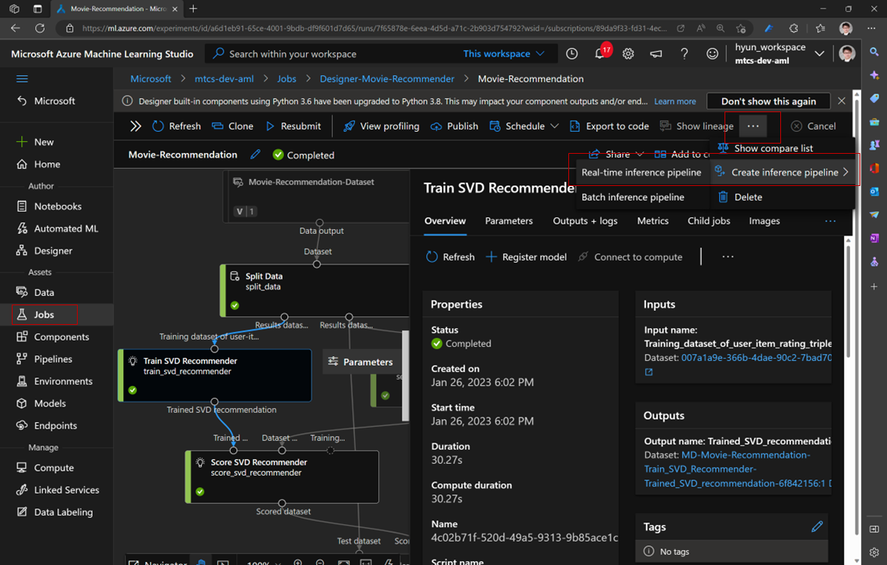
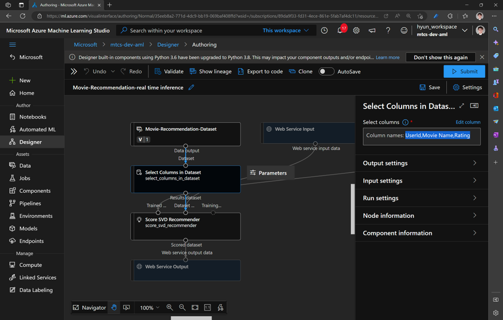
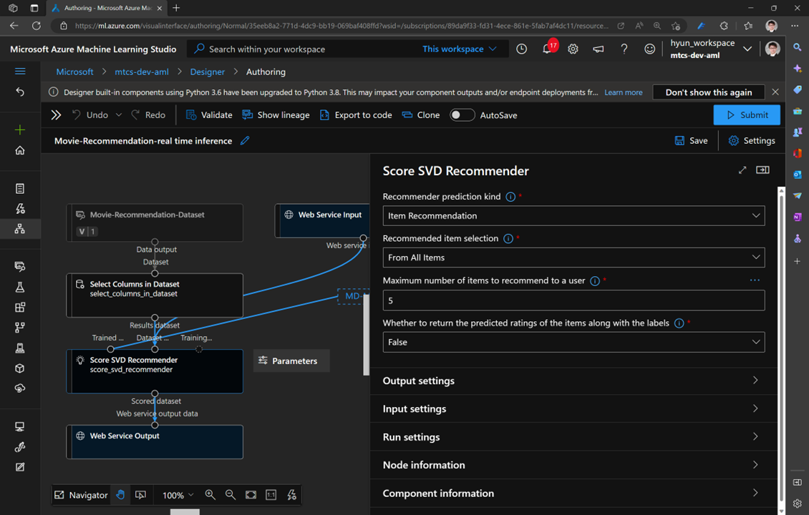
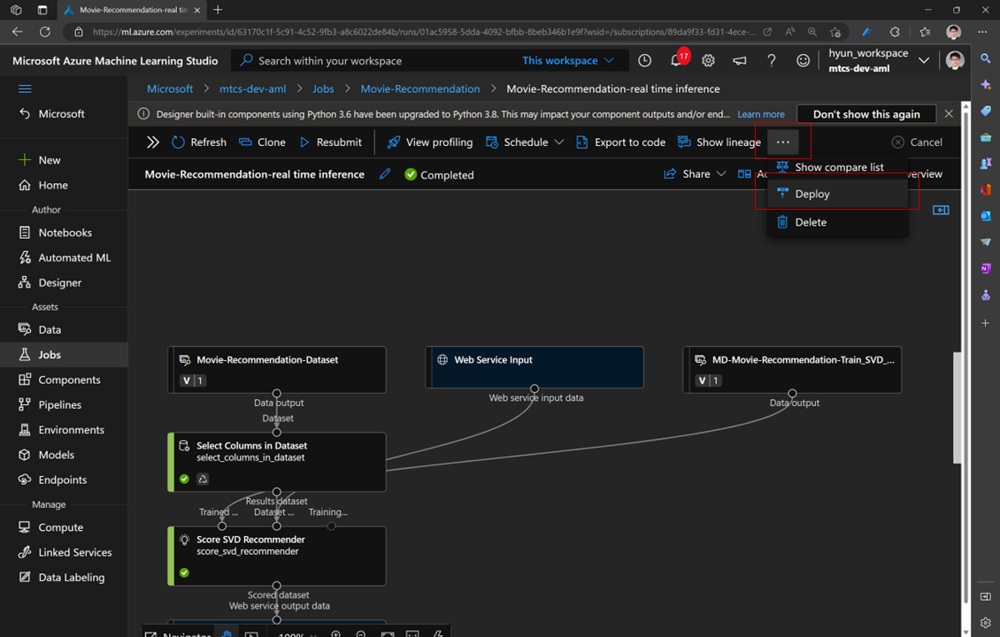
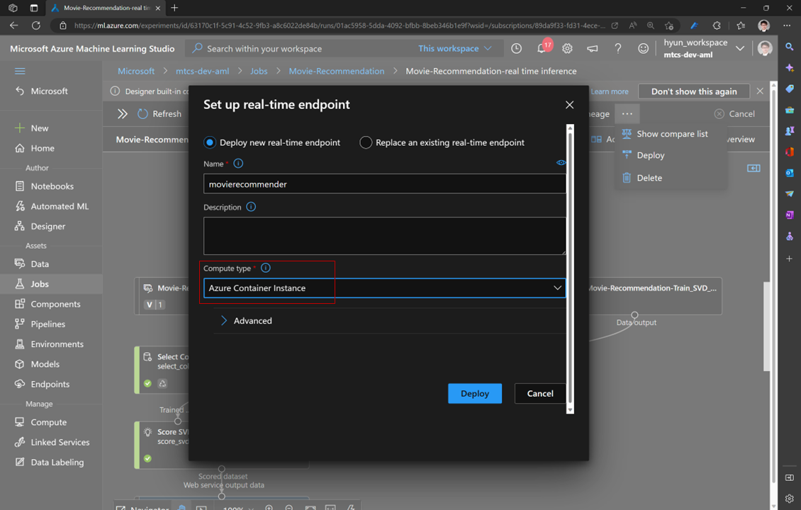
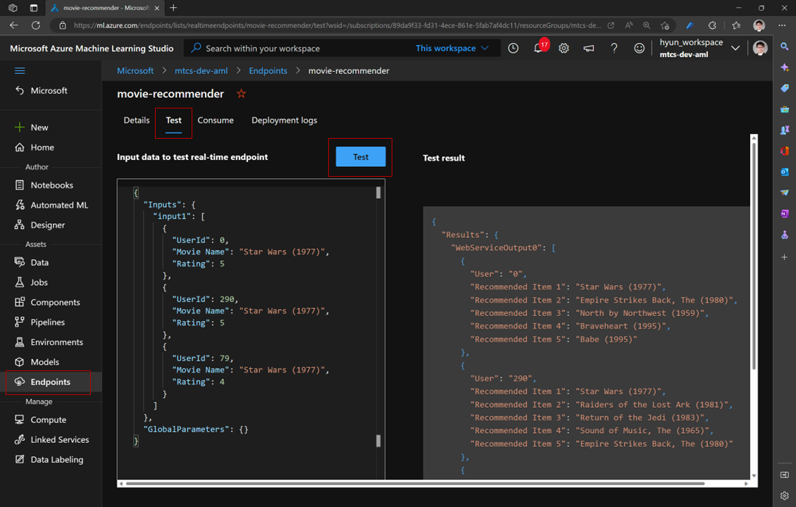

# Movie Recommender

## 3. Deploy SVD Recommender

To deploy trained SVD Recommender, you need to change parameters of the 'Score SVD Recommender' components accordingly.

The detail meaning of each parameters of the component can be found from [Score SVD Recommender](https://learn.microsoft.com/en-us/azure/machine-learning/component-reference/score-svd-recommender#)


### 3.1. Create inference pipeline

After job is done, you can create `'Real-time inference pipeline'` or 'Batch inference pipeline' from jobs

- Select `Jobs` and find your experiment, and then click `'...'` or `Create inference pipeline` and then click `'Real-time inference pipeline'`



### 3.2. Update Select Columns in Dataset

- You'll see a new pipeline canvas
- Doule click 'Select Columns in Dataset' and add Rating

```text
Rating
```



### 3.3. Update Score SVD Recommender for inference

Modify parameters of Score SVD Recommender like following

- Recommended item selection: From All Items



### 3.4. Delete Evaluate Recommender component

Select and delete Evaluate Recommender component

### 3.5. Submit job

Click `'Submit'` and `select 'Existing experiment'` name and click `'Submit'`

### 3.6. Ready to deploy

After job is done, you can click '`Deploy'` to deoply trained model as web service



### 3.7. Name deployment

Name the real-time endpoint, and select `'Azure Container Instance'` for `Compute type` and then `Click` `'Deploy'`



### 3.8 Test

Go to `'Endpoints'` and find your service name

And then select your service, click `'Test'` and than click '`Test'` to see results


